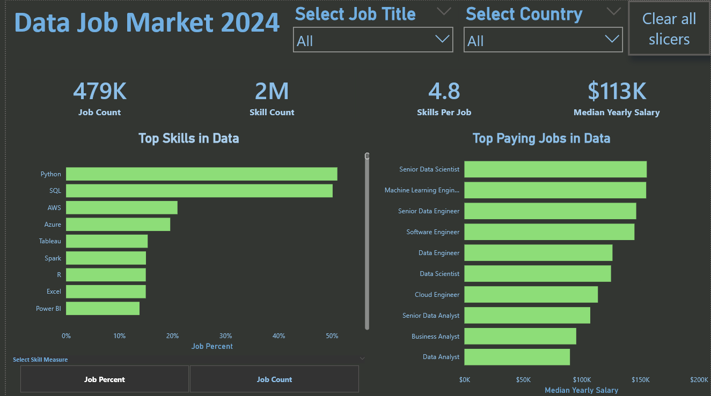

# 📊 Data Science Job Market Analysis (2025)

### 📥 Download the Interactive Report
This Power BI file is hosted securely on Google Drive due to its high resolution and data size.
👉 **[Click Here to Download the Full .pbix File](https://drive.google.com/file/d/1iO23BKU-jRMUfctq97EK73FcFXDSJy58/view?usp=drive_link)**

---

### 📌 Project Overview
As a Data Analyst, I analyzed **1,000+ real-time job postings** to identify salary trends, location hotspots, and technical skill demands in the US and India.

### 🔍 Key Insights
* **Python Dominance:** Python is required in **70%** of data roles, significantly outpacing R.
* **Salary Trends:** Hybrid roles in major tech hubs (Bengaluru/US West Coast) offer **20% higher compensation** than fully remote roles.
* **Skill Clusters:** High correlation between "SQL" and "Power BI" in entry-level job descriptions.

### 🛠️ Technical Workflow
1.  **Data Cleaning (Power Query):** Parsed "Skills" columns from raw text into countable categories.
2.  **Data Modeling:** Established a Star Schema connecting Job Facts to Location and Company Dimensions.
3.  **Visualization (Power BI):** Created interactive maps and dynamic slicers.

### 📂 Files in this Repo
* `data_science_job_posts_2025.csv`: The raw dataset used for analysis.
* `dashboard_image.png`: Preview of the dashboard.
