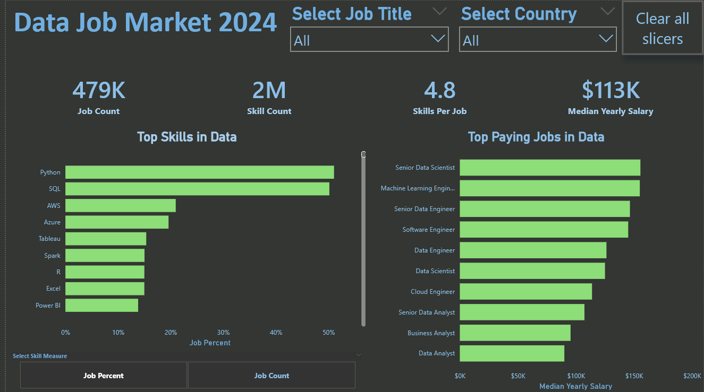

# Data Science Job Market Analysis

This project analyzes data-related job postings to identify trends in salary, location, job roles, and technical skill demand.

The project was built using Power BI, Power Query, and DAX. The goal is to convert raw job-posting data into an interactive dashboard that can support job-market and career-related insights.



## Project Objectives

The main questions explored in this project are:

1. Which technical skills are most frequently requested in data-related roles?
2. How do salaries vary by role, location, and work type?
3. Which locations show higher demand for data-related jobs?
4. How do remote, hybrid, and on-site roles compare?
5. What patterns can be observed in entry-level and experienced data roles?

## Tools Used

- Power BI
- Power Query
- DAX
- Excel/CSV data handling
- Data visualization
- Dashboard design

## Dataset

The analysis uses a job-posting dataset containing data-related roles, skills, salary information, locations, companies, and work type.

The full dataset and Power BI file are available through the download link below because the files are too large to store directly in this repository.

## Download Full Report

[Download the Power BI report and dataset](https://drive.google.com/file/d/1iO23BKU-jRMUfctq97EK73FcFXDSJy58/view?usp=drive_link)

## Workflow

1. Imported raw job-posting data into Power BI.
2. Cleaned and transformed fields using Power Query.
3. Parsed skill-related columns into analyzable categories.
4. Built a data model connecting job, company, location, and skill information.
5. Created DAX measures for job counts, salary summaries, and skill demand.
6. Designed an interactive Power BI dashboard with filters and visual insights.

## Dashboard Features

- Salary analysis by role and location
- Skill demand comparison
- Job distribution by country/city
- Remote, hybrid, and on-site work comparison
- Interactive slicers for filtering by role, location, and skills

## Key Insights

- Python and SQL appeared as common technical skills in data-related job postings.
- Salary patterns varied by location, role type, and work arrangement.
- Certain cities and regions showed stronger demand for data-related roles.
- Skill combinations such as SQL, Python, and Power BI appeared frequently in analytics-related jobs.

## Repository Structure

```text
Data-Science-Job-Market-Analysis/

README.md
dashboard_image.png

images/
    dashboard_overview.png
    salary_analysis.png
    skills_analysis.png
    location_analysis.png

docs/
    methodology.md
    key_insights.md

powerbi/
    dax_measures.md
